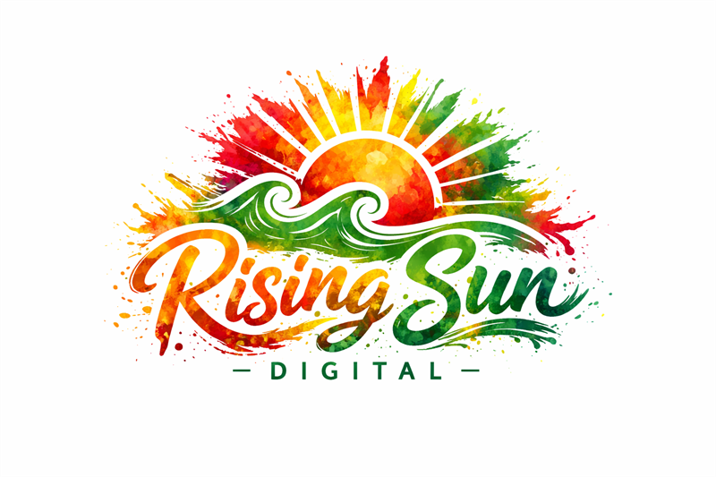

# Rising Sun Digital — Open Graph Export & Usage Guide

## 📸 HOW TO EXPORT OG IMAGES

### Method 1: Chrome DevTools (Recommended)

1. **Open the HTML file** in Google Chrome
2. Press `F12` to open DevTools
3. Press `Ctrl+Shift+M` (Windows) or `Cmd+Shift+M` (Mac) for device/responsive mode
4. In the device toolbar at the top, select **"Responsive"**
5. Set dimensions to **exactly 1200 × 630**
6. Press `Ctrl+Shift+P` (Windows) or `Cmd+Shift+P` (Mac)
7. Type "screenshot" and select **"Capture screenshot"**
8. Save as:
   - `og-primary.png` or `og-primary.jpg`
   - `og-light.png` or `og-light.jpg`
   - `og-textless.png` or `og-textless.jpg`

### Method 2: Online Screenshot Tool

1. Visit: https://www.screenshotmachine.com
2. Upload HTML file or paste rendered URL
3. Set dimensions: 1200 × 630
4. Download as PNG or JPG

### Method 3: Figma/Design Tool

1. Copy HTML/CSS into Figma using HTML to Design plugin
2. Export at exactly 1200 × 630px
3. Export as PNG (high quality) or JPG (smaller file size)

---

## 📏 EXPORT SETTINGS

### For Social Media (JPG — Recommended)
- **Format:** JPG
- **Dimensions:** 1200 × 630px (exactly)
- **Quality:** 85-90%
- **File size target:** Under 300KB
- **Color profile:** sRGB
- **Use for:** Facebook, LinkedIn, Twitter, Slack, iMessage

### For High Fidelity (PNG)
- **Format:** PNG
- **Dimensions:** 1200 × 630px (exactly)
- **Compression:** Medium (PNG-8 if possible)
- **File size target:** Under 1MB
- **Use for:** Press, investor decks, portfolio

---

## 🎯 WHEN TO USE EACH VARIANT

### **og-primary.html** — Dark Background
**USE FOR:**
- Main website (risingsun.digital)
- Blog posts
- Case studies
- Service pages
- Default fallback

**HEADLINE:** "Systems That Turn Traffic Into Revenue"
**TONE:** Confident, technical, CEO-level
**CONTEXT:** General-purpose, works everywhere

---

### **og-light.html** — Light/Cream Background
**USE FOR:**
- Landing pages with light design
- PDF downloads
- Guides and resources
- Softer, approachable content
- When shared in dark-mode apps (looks better in iMessage dark mode)

**HEADLINE:** "Predictable Leads. Real Growth."
**TONE:** Approachable, results-focused
**CONTEXT:** Lead magnets, educational content

---

### **og-textless.html** — Logo Only
**USE FOR:**
- Homepage fallback
- When you want brand recognition only
- International audiences (no English text to translate)
- Minimalist aesthetic
- Pure brand identity plays

**NO TEXT** — Just sacred geometry + logo
**TONE:** Premium, mysterious, design-forward
**CONTEXT:** Brand-first, not message-first

---

## 🧠 PSYCHOLOGY & STRATEGY

### Why These Work:

1. **Dark Background (Primary)**
   - Looks expensive
   - High contrast = mobile-friendly
   - Stands out in social feeds
   - Signals "tech/SaaS" authority

2. **Light Background (Light)**
   - Feels warm and approachable
   - Works well for lead magnets
   - Reduces skepticism
   - Better for service-based messaging

3. **Textless (Fallback)**
   - Pure brand play
   - Works when language doesn't
   - Looks intentional, not lazy
   - High-end aesthetic

---

## 🚀 IMPLEMENTATION

### Add to `index.html` (Primary Site)

```html
<!-- Open Graph Meta Tags -->
<meta property="og:type" content="website">
<meta property="og:url" content="https://risingsun.digital/">
<meta property="og:title" content="Rising Sun Digital — Systems That Turn Traffic Into Revenue">
<meta property="og:description" content="Growth systems for home service businesses. Predictable leads. Real growth. Built for the long game.">
<meta property="og:image" content="https://risingsun.digital/og-primary.jpg">
<meta property="og:image:width" content="1200">
<meta property="og:image:height" content="630">
<meta property="og:image:alt" content="Rising Sun Digital — Growth Systems">

<!-- Twitter Card -->
<meta name="twitter:card" content="summary_large_image">
<meta name="twitter:url" content="https://risingsun.digital/">
<meta name="twitter:title" content="Rising Sun Digital — Systems That Turn Traffic Into Revenue">
<meta name="twitter:description" content="Growth systems for home service businesses. Predictable leads. Real growth.">
<meta name="twitter:image" content="https://risingsun.digital/og-primary.jpg">
```

### Add to `thank-you.html` (Lead Magnet Pages)

```html
<!-- Open Graph Meta Tags -->
<meta property="og:type" content="website">
<meta property="og:url" content="https://risingsun.digital/thank-you.html">
<meta property="og:title" content="Your CTA Blueprint is Ready — Rising Sun Digital">
<meta property="og:description" content="Download your free 15-page guide revealing the 7 conversion killers costing you thousands.">
<meta property="og:image" content="https://risingsun.digital/og-light.jpg">
<meta property="og:image:width" content="1200">
<meta property="og:image:height" content="630">

<!-- Twitter Card -->
<meta name="twitter:card" content="summary_large_image">
<meta name="twitter:image" content="https://risingsun.digital/og-light.jpg">
```

---

## ✅ TESTING YOUR OG IMAGES

### Facebook Debugger
1. Go to: https://developers.facebook.com/tools/debug/
2. Enter your URL
3. Click "Scrape Again" to refresh cache
4. Verify image loads correctly

### LinkedIn Post Inspector
1. Go to: https://www.linkedin.com/post-inspector/
2. Enter URL
3. Check preview

### Twitter Card Validator
1. Go to: https://cards-dev.twitter.com/validator
2. Enter URL
3. Preview card

### iMessage Preview Test
1. Send your URL to yourself in iMessage
2. Check how the preview looks

---

## 🔥 OPTIMIZATION CHECKLIST

Before going live, verify:

- [ ] Image is **exactly 1200 × 630px**
- [ ] File size is **under 300KB** (JPG) or **under 1MB** (PNG)
- [ ] Text is **readable at thumbnail size**
- [ ] Logo is **visible and clear**
- [ ] No fine details that disappear when small
- [ ] High contrast for mobile viewing
- [ ] Looks good on both light and dark backgrounds (test in Slack, iMessage, LinkedIn)

---

## 📊 WHEN TO UPDATE

### Swap OG images when:

1. **Launching a new service** → Create variant with new headline
2. **Running a campaign** → Temporary OG with campaign message
3. **Seasonal promotions** → Holiday/seasonal messaging
4. **Rebranding** → Update logo/colors across all variants
5. **A/B testing** → Test different headlines to see what gets more clicks

### DON'T change OG images:
- Every week
- For minor copy tweaks
- Without testing first

**Consistency = brand recognition.**

---

## 🎨 CUSTOMIZATION GUIDE

### To Change Headline:

1. Open `og-primary.html` in code editor
2. Find the `<h1 class="headline">` section
3. Replace text (keep it under 10 words)
4. Re-export at 1200 × 630px

### To Change Colors:

1. Find the `.logo-circle` gradient
2. Update hex codes to match your brand
3. Update `.gradient-text` colors
4. Keep contrast high for readability

### To Swap Logo:

If you want to use your actual PNG logo instead of CSS version:

```html
<!-- Replace the .logo-container div with: -->
<div class="logo-container">
    
</div>
```

---

## 💰 WHAT MAKES THIS MULTI-MILLION-DOLLAR QUALITY

### ✅ Professional Signals:
- Clean, intentional layout
- High contrast (mobile-first)
- Sacred geometry (Afrofuturism aesthetic)
- Breathing room (not cramped)
- Premium typography (Inter — trusted by Stripe, Figma, GitHub)
- Subtle patterns (not busy)
- Minimal text (CEO-level, not salesy)

### ✅ Technical Excellence:
- Exact 1.91:1 aspect ratio (1200×630)
- Safe crop zones
- Optimized file sizes
- Scalable system (3 variants, not just 1)

### ✅ Strategic Thinking:
- Different images for different contexts
- Textless fallback for international/brand plays
- A/B testable
- Future-proof design system

---

## 🚀 NEXT STEPS

1. **Export all 3 variants** using Chrome DevTools
2. **Upload to your server** at risingsun.digital root
3. **Add OG meta tags** to index.html and thank-you.html
4. **Test with Facebook Debugger** (force refresh cache)
5. **Share on LinkedIn/Twitter** to see live preview
6. **Monitor click-through rates** vs. old OG (if you had one)

---

## 🆘 TROUBLESHOOTING

**Image not showing on Facebook/LinkedIn:**
- Clear cache using Facebook Debugger
- Verify file is publicly accessible (not localhost)
- Check file size (under 8MB for Facebook)

**Image looks blurry:**
- Re-export at exactly 1200 × 630px
- Use PNG instead of JPG
- Increase JPG quality to 90%

**Text is hard to read:**
- Increase contrast
- Make text larger
- Use bold weights only

---

**You now have a multi-million-dollar Open Graph system.** 🔥

Deploy it. Test it. Let the previews do the selling before the click.
